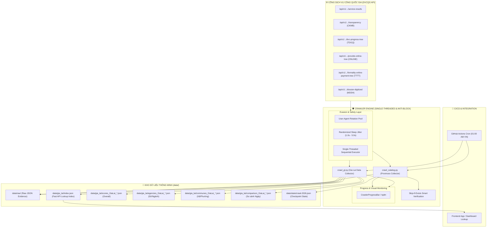
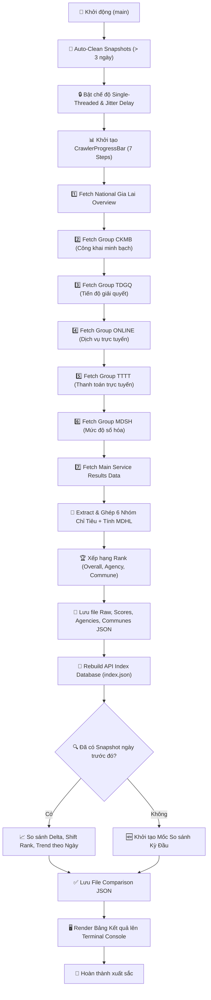

# 📊 Crawler 766 - DVCQG Evaluation Data Extractor & Indexer

Hệ thống tự động trích xuất, phân loại, build API Index và so sánh điểm số đánh giá chất lượng phục vụ người dân, doanh nghiệp trong thực hiện thủ tục hành chính, dịch vụ công (theo **Quyết định 766/QĐ-TTg**) của **UBND tỉnh Gia Lai** và các Tỉnh/Thành phố từ Cổng Dịch vụ công Quốc gia (DVCQG).

---

## 🌟 Tính Năng Nổi Bật

- **📊 Trích xuất Đầy đủ 6 Nhóm Chỉ tiêu Thành phần (`groupScores`)**:
  - `CKMB`: Công khai, minh bạch (Tối đa 18 điểm)
  - `TDGQ`: Tiến độ giải quyết (Tối đa 20 điểm)
  - `CLGQ` / `ONLINE`: Dịch vụ trực tuyến / Chất lượng giải quyết (Tối đa 12 điểm)
  - `TTTT`: Thanh toán trực tuyến (Tối đa 10 điểm)
  - `MDHL`: Mức độ hài lòng (Tối đa 18 điểm)
  - `MDSH`: Số hóa hồ sơ (Tối đa 22 điểm)
- **🏢 Phân loại Đơn vị Con**: Phân tách 149 đơn vị con thành 2 khối chính:
  - **Khối Sở / Ban / Ngành (`AGENCY`)**: 14 đơn vị (Sở Công Thương, Sở Y tế, Sở Nông nghiệp & Môi trường, BQL Khu kinh tế,...)
  - **Khối UBND Xã / Phường / Thị trấn (`COMMUNE`)**: 135 đơn vị (UBND xã Tây Sơn, UBND xã Tuy Phước, UBND xã Lơ Pang,...)
- **🚀 API Index Database (`data/gia_lai/index.json`)**: Tự động tạo và duy trì file cơ sở dữ liệu Index tốc độ cao, hỗ trợ ứng dụng client tra cứu cực nhanh theo mã đơn vị (`departmentCode` - VD: `H21.17`, `H21.217`), ID đơn vị hoặc theo từng mốc ngày.
- **🗓️ Quản lý Snapshot theo Mốc Ngày (`DDMMYYYY`)**: Lưu dữ liệu theo chuẩn ngày chạy thực tế (VD: `scores_GiaLai_23092026.json`, `agencies_GiaLai_23092026.json`, `communes_GiaLai_23092026.json`).
- **📈 Engine So sánh Điểm Đồng bộ theo Ngày (Daily Comparison Engine)**: Tự động so sánh chênh lệch điểm số (`scoreDeltaDaily`), biến động thứ hạng (`rankChangeDaily`) và sự thay đổi từng nhóm chỉ tiêu giữa mốc ngày hiện tại với mốc ngày trước đó.
- **🧹 Tự động Clean Dữ liệu Cũ (`Auto-Clean > 3 ngày`)**: Quét và tự động xóa sạch các file snapshot và bản ghi trong index có tuổi thọ lớn hơn 3 ngày (72 giờ) để đảm bảo bộ nhớ và tính cập nhật.
- **🛡️ Cơ chế Đảo User-Agent & Evasion (Anti-Blocking)**: Xoay vòng User-Agent hiện đại (Chrome 124/125, Edge, Firefox, Safari), ngẫu nhiên hóa request headers và độ trễ jitter (0.2s - 0.5s) chống chặn IP/WAF rate-limit từ DVCQG.
- **⏰ Tự động hóa CI/CD GitHub Actions**: Tự động chạy task crawler lúc **01:00 sáng hàng ngày (Giờ Việt Nam)** qua workflow `.github/workflows/Crawler-766.yml`.

---

## 🏗️ Sơ Đồ & Mô Hình Hoạt Động (Architecture & Flowchart)

### 1. Sơ đồ Kiến trúc Hệ thống (System Architecture)



### 2. Quy trình Thực thi Trích xuất & So sánh Điểm (Execution Lifecycle)



---


## 📁 Cấu Trúc Dữ Liệu (`data/`)

```text
data/
├── config/
│   ├── provinces.json                     # Danh mục 34 Tỉnh/Thành phố
│   └── departments.json                   # Danh mục các đơn vị hành chính
├── gia_lai/
│   ├── index.json                         # API Index Database duy nhất cho client lookup
│   ├── scores_GiaLai_DDMMYYYY.json        # Dữ liệu điểm số tổng hợp 149 đơn vị
│   ├── agencies_GiaLai_DDMMYYYY.json      # Dữ liệu điểm số Khối Sở/Ban/Ngành
│   ├── communes_GiaLai_DDMMYYYY.json      # Dữ liệu điểm số Khối UBND Xã/Phường
│   ├── details_GiaLai_DDMMYYYY.json       # Dữ liệu chi tiết toàn bộ các chỉ tiêu con & thành phần đơn vị
│   └── comparison_GiaLai_DDMMYYYY.json    # File so sánh điểm số & xu hướng theo ngày
└── raw/
    └── 2026/
        └── gia_lai/
            ├── raw_GiaLai_DDMMYYYY.json   # Dữ liệu RAW JSON nguyên bản từ DVCQG API
            └── checkpoints/               # Dữ liệu checkpoint tự động lưu vết chống lỗi mạng
```

---

## 🛠️ Hướng Dẫn Cài Đặt & Sử Dụng

### 1. Cài đặt Môi trường
```bash
# Clone repository
git clone https://github.com/duynghiaqn/Crawler-766.git
cd "Crawler 766"

# Cài đặt các thư viện phụ thuộc
pip install -r tools/requirements.txt
```

### 2. Thực thi Tool Crawler Gia Lai (`tools/crawl_gl.py`)

```bash
# Trích xuất dữ liệu Gia Lai theo Tháng (Ví dụ: Tháng 3/2026)
python3 tools/crawl_gl.py --time-type month --year 2026 --period 3

# Trích xuất dữ liệu Gia Lai theo Quý
python3 tools/crawl_gl.py --time-type quarter --year 2026 --period 1

# Trích xuất dữ liệu Gia Lai theo Năm
python3 tools/crawl_gl.py --time-type year --year 2026

# Lọc chỉ hiển thị Khối Sở/Ngành trên Console
python3 tools/crawl_gl.py --group AGENCY

# Lọc chỉ hiển thị Khối UBND Xã/Phường trên Console
python3 tools/crawl_gl.py --group COMMUNE

# Tự động clean snapshot cũ quá N ngày (Mặc định: 3 ngày)
python3 tools/crawl_gl.py --clean-days 3
```

Hoặc gọi trực tiếp qua wrapper CLI script:
```bash
./tools/crawl-gl --time-type month --year 2026 --period 3
```

---

## 🔍 Cấu Trúc File Index API (`data/gia_lai/index.json`)

File `data/gia_lai/index.json` được thiết kế tối ưu cho các dịch vụ Backend/Frontend API tra cứu trực tiếp:

```json
{
  "schemaVersion": 1,
  "updatedAt": "2026-09-23T16:25:00Z",
  "latestDate": "23092026",
  "province": {
    "name": "UBND tỉnh Gia Lai",
    "code": "H21",
    "id": "019d2be3-6a85-74ec-a346-6489e82ae4c7"
  },
  "availableDates": ["23092026"],
  "agenciesList": [ ... ],
  "communesList": [ ... ],
  "departmentsIndex": {
    "H21.17": {
      "departmentId": "019d2be3-6a85-74ec-a347-77b9087c81c4",
      "departmentName": "Sở Văn hóa, Thể thao và Du lịch - tỉnh Gia Lai",
      "departmentCode": "H21.17",
      "childGroup": "AGENCY",
      "latest": {
        "date": "23092026",
        "totalScore": 79.16,
        "ratio": 79.16,
        "rank": 1,
        "groupScores": {
          "CKMB": 2.0,
          "TDGQ": 20.0,
          "ONLINE": 6.0,
          "TTTT": 0.0,
          "MDSH": 14.0,
          "MDHL": 18.0
        }
      }
    }
  }
}
```

---

## 🤖 Tự Động Hóa Với GitHub Actions

Hệ thống được trang bị 2 Workflows CI/CD tự động:

1. **Workflow Tổng hợp Hàng ngày** ([`.github/workflows/Crawler-766.yml`](.github/workflows/Crawler-766.yml)):
   - **Schedule Cron**: `0 18 * * *` (01:00 AM Việt Nam).
   - Tự động trích xuất điểm số, build API Index & so sánh biến động ngày.

2. **Workflow Trích xuất Chi tiết Chỉ tiêu Con & Thành phần** ([`.github/workflows/Crawler-766-detail.yml`](.github/workflows/Crawler-766-detail.yml)):
   - **Schedule Cron**: `30 18 * * *` (01:30 AM Việt Nam).
   - Tự động trích xuất chuyên sâu 6 nhóm chỉ tiêu con thành phần cho toàn bộ 149 đơn vị con (`details_GiaLai_DDMMYYYY.json`).

---

## 📄 Giấy Phép & Nguyên Tắc An Toàn

- Dữ liệu được trích xuất công khai từ Cổng DVCQG (`https://dichvucong.gov.vn`).
- Crawler tuân thủ các nguyên tắc an toàn dữ liệu: lưu RAW JSON làm nguồn sự thật, tối ưu tần suất request, không spam song song và tự động làm sạch dữ liệu cũ quá 3 ngày.
